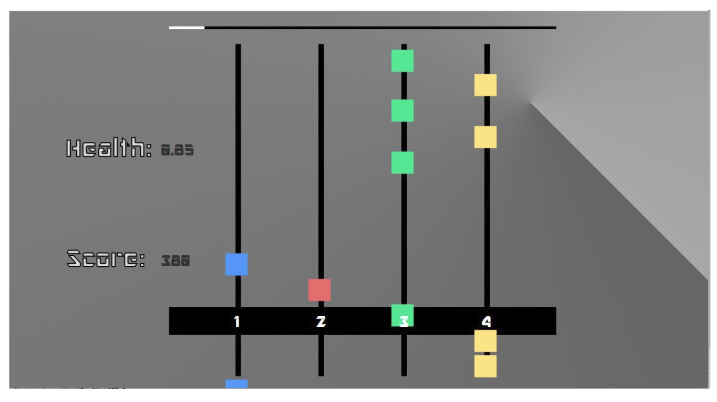

### Contributors:
[Jon Bernal](https://github.com/jonbernal), [Sammy Pulos](https://github.com/scuPulos), [Andrew Chang](https://github.com/asoochang)

Santa Clara University  
COEN 275 - Spring 2019

------
RhythmMaster is a rhythm-based game where the player presses buttons in beat with the music. The game consists of 4 vertical rails, with each rail corresponding with the 1, 2, 3, 4 number keys. Each rail has markers that are spawned at the top of the rail that move down the rail with a constant velocity towards the horizontal hit bar found near the bottom of the game screen.

The player should press the corresponding rail button once a marker touches the hitbar - this counts as a "hit". A “miss” occurs in 2 cases: either the player presses (for instance) rail button 3 but there is no marker touching the hit bar for rail 3, or the marker exits the hit bar and there is no button press for that rail. A “hit” will increase the player’s score by 10 points while a “miss” will decrease their score by 5.

Game “easiness” is implemented via a hit bar tolerance area found on both the top and bottom edges of the hit bar. The tolerance is user-settable in the Settings menu. A tolerance setting of 1.0 will add 50 pixels to both the top and bottom of the hit bar, widening the window used to determine hits and misses. For a tolerance setting of 0, hit detection only considers the coordinates of the hit bar in relation to any markers present. 
